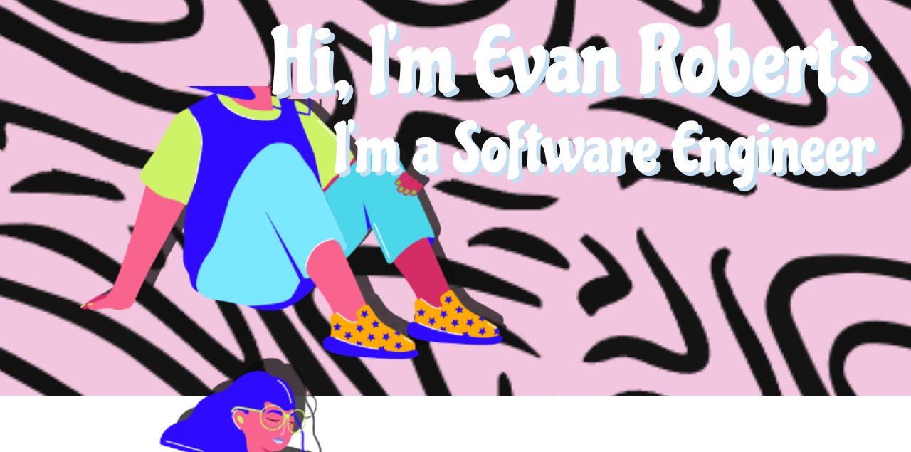

<h3 align="left">Currently Working On:</h3>

freeCodeCamp's entire curriculum

<h3 align="left">Languages:</h3>

 

<h3 align="left">Technologies:</h3>

 

<h3 align="left">Software:</h3>

 

<h3><a href="https://gist.github.com/Evan-Roberts-808">View My Gists</a></h3>
<h3 align="left">Projects:</h3>

<table align="center">
<thead>
  <th>Project</th>
  <th>Description</th>
  <th>Tech stack</th>
  <th>Features</th>
  <th>Repo</th>
  <th>Live</th>
</thead>
<tbody>
    <tr>
    <td>GunplaPal</td>
    <td>GunplaPAL is a dedicated database and collection tracker for
                  Gunpla enthusiasts. Our platform provides a comprehensive
                  collection of Gunpla kits, making it easier for you to
                  explore, track, and manage your collection.</td>
    <td><ul><li>React</li><li>React Router v6</li><li>React-Bootstrap</li><li>Flask</li><li>Flask_Restful</li><li>SQLAlchemy</li></ul></td>
    <td><ul><li>Extensive Gunpla Database with over 3000 model kits</li><li>User profile creation, to sign up and track their collection and wishlist</li><li>Custom Gunpla API created by us</li></ul></td>
    <td><a href="https://github.com/Evan-Roberts-808/Gunpla-Pal" target="_blank">Repo</a></td>
    <td><a href="https://gunpla-pal.vercel.app" target="_blank">Live</a></td>
  </tr>
  <tr>
    <td>Chocotonic</td>
    <td>Chocotonic is a chocolate company with a mission to make a
                    positive impact on the environment and promote
                    sustainability. Our passion for creating delicious chocolate
                    treats goes hand in hand with our commitment to creating a
                    brighter and greener future.</td>
    <td><ul><li>React</li><li>React Router V6</li><li>React Bootstrap</li><li>Flask</li><li>Flask-Restful</li><li>Flask-SQLAlchemy</li></td>
      <td><ul><li>User Creation & Validation</li><li>Full "Hypothetical" Shopping Functionality</li><li>CLI for viewing user orders, updating status', and "ordering" product inventory</li><li>Responsive Design & Custom Designed Products</li></ul></td>
      <td><a
                      href="https://github.com/Evan-Roberts-808/Chocotonic"
                      target="_blank"
                    >Repo</a></td>
      <td><a href="https://chocotonic.vercel.app" target="_blank">Live</a></td>
  </tr>
  <tr>
    <td>Bites&Brews</td>
    <td>Recipe / Cocktail site that allows users to browse meal and cocktail recipes and get the ingredient list and directions. Also allows for favoriting and submitting of recipes as well as getting a pairing recommendation.</td>
    <td><ul><li>React</li><li>React Router v6</li><li>React-Bootstrap</li></ul></td>
    <td><ul><li>Full CRUD functionality</li><li>Multiple React Hooks</li><li>Internal Routing</li><li>Our own API</li></ul></td>
    <td><a href="https://github.com/Evan-Roberts-808/Bites-and-Brews" target="_blank">Repo</a></td>
    <td><a href="https://bites-and-brews.vercel.app" target="_blank">Live</a></td>
  </tr>
  <tr>
    <td>Pokedex</td>
    <td>A Pokemon search app built using PokeApi. Allows users to view all 1000+ Pokemon, search for specific Pokemon, filter by gen. or type, and add Pokemon to their favorites</td>
    <td><ul><li>HTML/CSS</li><li>Vanilla JS</li><li>BootStrap</li></ul></td>
    <td><ul><li>PokeApi Connection</li><li>Responsive Design</li><li>Full CRUD Functionality</li></ul></td>
    <td><a href="https://github.com/Evan-Roberts-808/PokeDex" target="_blank">Repo</a></td>
    <td><a href="https://evan-roberts-808.github.io/PokeDex/" target="_blank">Live</a></td>
  </tr>

</tbody>
</table>

<h3 align="left">Stats:</h3>

<h3 align="left">&nbsp;Heres What I'm Listening To:</h3>

<a href="https://www.data-card-for-spotify.com/card?user_id=leoslastwill">
  
</a>

